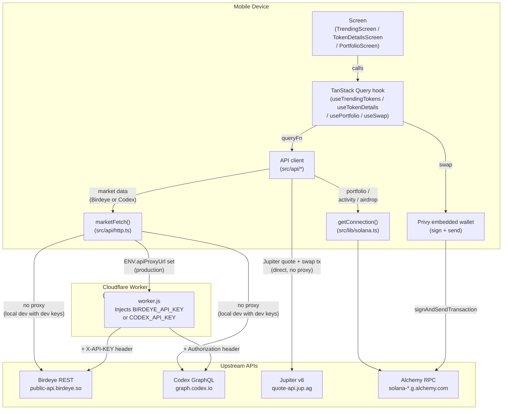

# Architecture

## Services and their roles

**Privy (`@privy-io/expo`)**
Handles all authentication and the embedded Solana wallet. The app calls Privy for login (email OTP, Google OAuth) and for signing transactions. Privy manages the wallet private key in its own secure enclave — the app never sees it directly. Configuration lives in `src/lib/privy.tsx`.

**React Native app (Expo Dev Client)**
The UI layer. Four screens rendered in a React Navigation native stack + bottom tab navigator. All server state is managed by TanStack Query hooks in `src/hooks/`. There is no separate client-side state management library in active use (see [Decision Log §3](08_decisions.md)).

**TanStack Query**
Caches all remote data fetches, manages background refetch intervals, and surfaces loading/error states to screens. Global defaults are set in `src/lib/queryClient.ts`. Hook-specific overrides live in each hook file. See [Data Layer](03_data_layer.md) for per-hook details.

**Cloudflare Worker (`cloudflare/worker.js`)**
A thin HTTP proxy deployed on Cloudflare Workers. The mobile app calls the worker; the worker injects the Birdeye and Codex API keys from Worker Secrets (stored server-side, not in the app bundle) and forwards the request upstream. The app does not need to know the actual API keys at runtime. See [proxy vs direct](#why-birdeye-and-codex-go-through-a-proxy-but-jupiter-does-not) below.

**Birdeye (REST market data)**
Primary source for trending token lists, token overviews, OHLCV price history, recent trades, and batched USD prices for portfolio valuation. All calls go through `src/api/birdeye.ts` → `marketFetch` in `src/api/http.ts` → Cloudflare Worker in production.

**Codex.io (GraphQL market data)**
Fallback source. Used when Birdeye returns an empty result or throws. Provides trending tokens and OHLCV bars via GraphQL at `https://graph.codex.io/graphql`. All calls go through `src/api/codex.ts` → `marketFetch` → Cloudflare Worker.

**Jupiter Aggregator v6**
Solana DEX aggregator. Called directly from the device (no proxy) to obtain swap quotes and build swap transactions. The app calls `https://quote-api.jup.ag/v6/quote` and `/swap`. Jupiter does not require an API key; direct calls from the device are acceptable. Swaps are mainnet-only. See [Trading Flow](05_trading_flow.md).

**Alchemy (Solana RPC)**
Provides the `Connection` object used by `@solana/web3.js` for all on-chain reads and writes: `getBalance`, `getParsedTokenAccountsByOwner`, `getSignaturesForAddress`, `requestAirdrop`. Configured in `src/lib/solana.ts`. Falls back to the public Solana cluster API (`clusterApiUrl`) when the Alchemy key is absent.

> **Supabase note:** Supabase is listed as an available tool in the assignment, but the app does not use it for any flow (auth is Privy, market data is Birdeye/Codex, balances are Alchemy RPC, net-worth history is local AsyncStorage). The previously-scaffolded, never-imported `SupabaseClient` and its config were removed to keep the dependency surface aligned with what the app actually does.

---

## Full data path — flowchart

---

## Why Birdeye and Codex go through a proxy, but Jupiter does not

**Birdeye and Codex** both require secret API keys passed in HTTP headers (`X-API-KEY` for Birdeye, `Authorization` for Codex). If those keys were bundled into the mobile app they would be visible to anyone who extracts the JS bundle. The Cloudflare Worker solves this by holding the keys as Worker Secrets (set via `wrangler secret put`, stored server-side, never in source control or the bundle) and injecting them per-request.

The mechanism in `src/api/http.ts::marketFetch` (lines 33–44):
1. If `ENV.apiProxyUrl` is set, prefix the URL with the worker base and send no key headers — the worker adds them.
2. If `ENV.apiProxyUrl` is empty (local dev), call the upstream APIs directly using `ENV.devBirdeyeKey` / `ENV.devCodexKey` from the local `.env` file.

In `cloudflare/worker.js` (lines 38–60), the worker reads `env.BIRDEYE_API_KEY` and `env.CODEX_API_KEY` from Worker Secrets at request time and sets the appropriate header before forwarding.

**Jupiter** has no authentication requirement. The v6 quote and swap endpoints at `https://quote-api.jup.ag/v6` are public and rate-limited by IP, not by API key. There is no secret to hide, so routing through a proxy would add latency and operational complexity for no security benefit. The calls go directly through `jsonFetch` in `src/api/http.ts`.
