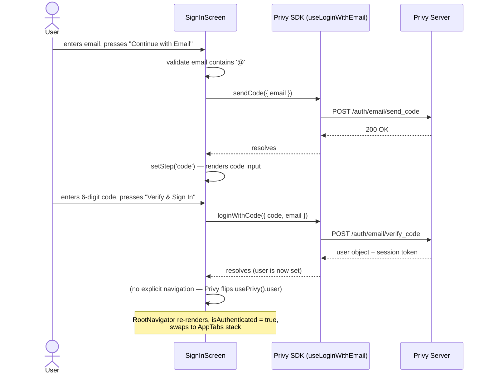
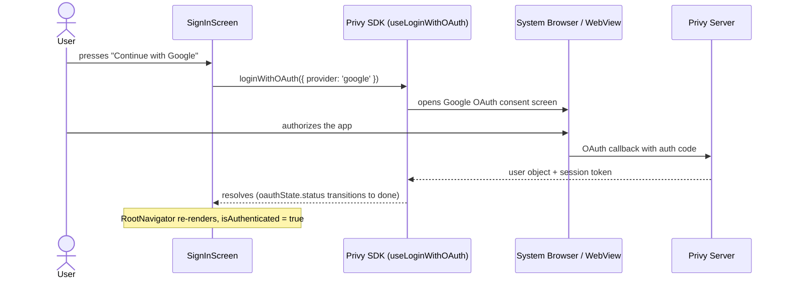

# Auth and Wallet

## Files covered

| File | Role |
|------|------|
| `src/lib/privy.tsx` | Wraps the app in `BasePrivyProvider` with embedded Solana wallet config |
| `src/hooks/useWallet.ts` | Convenience facade over Privy's auth and wallet state |
| `src/navigation/RootNavigator.tsx` | Conditionally renders sign-in screen or authenticated tab stack |
| `src/screens/SignInScreen.tsx` | UI for email OTP and Google OAuth flows |

---

## PrivyProvider configuration (`src/lib/privy.tsx`)

`PrivyProvider` wraps `BasePrivyProvider` from `@privy-io/expo` with two meaningful config values:

```
config.embedded.solana.createOnLogin = 'users-without-wallets'
```

This tells Privy to automatically create an embedded Solana wallet for any user who logs in and does not already have one. The wallet is created server-side by Privy during the login response — the app does not call any create function during normal login.

`PrivyElements` is rendered as a child of the provider. It supplies Privy's native UI sheets (used internally by Privy for OAuth redirects and passkey flows). `accentColor` is set to `colors.primary` (`#00E599`) and `colorScheme` to `'dark'`.

---

## useWallet hook (`src/hooks/useWallet.ts`)

`useWallet` combines `usePrivy` and `useEmbeddedSolanaWallet` into a single object. It does not add business logic beyond two convenience derivations:

**`address`** — derived from `wallets[0].address ?? getUserEmbeddedSolanaWallet(user)?.address`. The first source (`wallets[0]`) comes from the live wallet list returned by `useEmbeddedSolanaWallet`. The second (`getUserEmbeddedSolanaWallet(user)`) reads the address from the Privy user object directly. Both are checked so the address is available immediately from the user object even when the live wallet list hasn't resolved yet.

**`ensureWallet`** — calls `create()` from `useEmbeddedSolanaWallet` if `wallet` is still undefined. This is a fallback for the rare case where `createOnLogin` did not run (e.g., a user who signed up before embedded wallets were enabled for the Privy app). The function does nothing if a wallet already exists.

`ensureWallet` is called in `src/screens/PortfolioScreen.tsx`'s `onRefresh` handler (line 43), which runs on pull-to-refresh. It is not called on screen mount. This means the first render of PortfolioScreen can proceed without a wallet address; the portfolio query is gated by `enabled: !!owner` (see `usePortfolio` in `src/hooks/usePortfolio.ts`).

---

## RootNavigator: auth gate (`src/navigation/RootNavigator.tsx`)

`RootNavigator` calls `useWallet()` and reads two values: `isReady` and `isAuthenticated`.

- **`isReady`** comes from `usePrivy().isReady`. It is `false` until the Privy SDK has finished initializing and determined whether a session exists. While `isReady` is false, the navigator renders a full-screen `ActivityIndicator`.
- **`isAuthenticated`** is `!!user` from `usePrivy().user`. It is `true` only after a successful login.

When `isReady` is `true`:
- If `isAuthenticated` is `true`: render the `NavigationContainer` with a native stack containing `AppTabs` (the bottom tabs) and `TokenDetails` (pushed on top).
- If `isAuthenticated` is `false`: render `SignInScreen` directly inside `NavigationContainer` with no stack navigator. `SignInScreen` is not a stack screen — it has no back button and no header.

When Privy's auth state changes (login succeeds or user logs out), React re-renders `RootNavigator`, and the conditional switches the tree. React Navigation handles the mount/unmount cleanly.

---

## Email OTP sign-in sequence



The `step` state in `SignInScreen` is local: `'email'` shows the email input and a "Continue with Email" button; `'code'` shows the OTP input and a "Verify & Sign In" button. There is a "Use a different email" ghost button on the code step that resets `step` to `'email'` and clears the code input without calling any Privy function.

Email format validation is minimal: the component only checks that the string includes `'@'` before calling `sendCode`.

---

## Google OAuth sign-in sequence



`oauthState.status` from `useLoginWithOAuth` drives the loading spinner on the "Continue with Google" button (`loading={oauthState.status === 'loading'}`). The button's `onPress` catches errors and sets the local `error` state string, but no retry logic exists.

---

## Embedded wallet creation

The wallet is created automatically by Privy during the login response when `createOnLogin: 'users-without-wallets'` is set. This happens server-side; from the app's perspective, the `wallets` array from `useEmbeddedSolanaWallet` is populated by the time the user first lands on a screen.

The `ensureWallet` function in `useWallet` (`src/hooks/useWallet.ts:20`) is a manual fallback: it calls `create()` only if `wallet` is still undefined. It is invoked in `PortfolioScreen.onRefresh` (`src/screens/PortfolioScreen.tsx:43`) as a defensive measure during pull-to-refresh, not during the normal login path.
