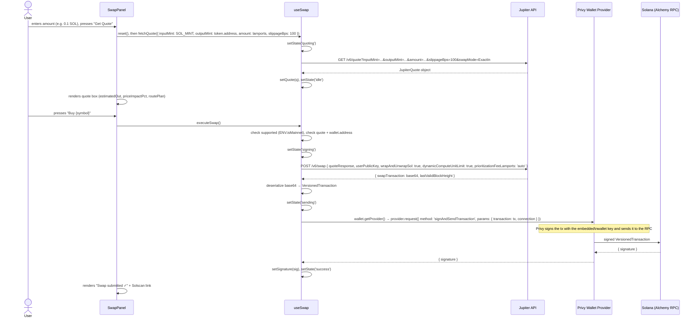

# Trading Flow

## Files covered

| File | Role |
|------|------|
| `src/hooks/useSwap.ts` | State machine and Jupiter API calls |
| `src/components/SwapPanel.tsx` | UI that drives useSwap |

---

## State machine

`useSwap` tracks one of five string states: `'idle' | 'quoting' | 'signing' | 'sending' | 'success' | 'error'`. These six values (not five) map to UI states as follows:

| State | Meaning |
|-------|---------|
| `idle` | Nothing in progress. Initial state. Also the state after `fetchQuote` completes successfully. |
| `quoting` | `getJupiterQuote` request in flight. |
| `signing` | `getJupiterSwapTransaction` request in flight (building the tx), and wallet provider being called. |
| `sending` | `provider.request({ method: 'signAndSendTransaction', ... })` in flight. |
| `success` | Transaction submitted. `signature` is populated. |
| `error` | Any step above threw. `error` string is populated. |

`reset()` sets state back to `idle` and clears `quote`, `error`, and `signature`.

---

## Mainnet gating

`const supported = ENV.isMainnet` (`src/hooks/useSwap.ts:24`).

If `supported` is false:
- `executeSwap` returns early with `setError('Swaps require Mainnet (Jupiter has no devnet liquidity).')` and sets state to `'error'`.
- In `SwapPanel`, the buy button renders with title `'Preview only (Devnet)'` and `disabled={true}`.
- The "Get Quote" button still works and will call Jupiter even on devnet, but `executeSwap` will reject if pressed.

This gating exists because Jupiter's routing and liquidity pools only exist on mainnet-beta. Fetching a quote against a devnet address would return a quote for the mainnet token (Jupiter doesn't have separate devnet tokens), and trying to execute it would fail because the devnet wallet has no actual mainnet funds.

---

## Slippage

The default slippage is **100 basis points (1%)**, set as the literal value `slippageBps: 100` in `SwapPanel.tsx::handleQuote` (line 33 of `src/components/SwapPanel.tsx`). This value is not configurable by the user through the UI. It is passed to `getJupiterQuote` which forwards it to the Jupiter API as the `slippageBps` query parameter.

There is no UI for changing slippage. 100 bps is passed unconditionally whenever `handleQuote` fires.

---

## Quote staleness

When the user types or adjusts the SOL amount in the input, `setAmount` updates local state but does **not** call `reset()` or `fetchQuote`. The existing quote (if any) stays displayed until the user presses "Get Quote" again.

`handleQuote` calls `reset()` before calling `fetchQuote`, which clears any previous quote, error, or signature from state. So the flow is:

1. User has a quote displayed.
2. User changes the amount input.
3. Old quote remains visible.
4. User presses "Get Quote".
5. `reset()` runs — quote cleared, state → `idle`.
6. `fetchQuote` runs — state → `quoting`.
7. New quote arrives — state → `idle`, new `quote` set.

There is no automatic re-quoting when the amount changes. There is also no expiry timer on the quote; Jupiter quotes expire after a short server-side window (typically ~30 seconds based on Jupiter's documentation), but the app does not enforce this or warn the user. If the user waits too long after getting a quote and then presses the buy button, the `/swap` call will still succeed in building the transaction (which contains the quote), but the transaction may fail on-chain if the market has moved past the slippage tolerance.

---

## Full swap sequence



---

## Signing mechanism

The app uses `wallet.getProvider()` from the Privy embedded wallet, then calls:

```ts
provider.request({
  method: 'signAndSendTransaction',
  params: { transaction: tx, connection },
})
```

This is Privy's EIP-1193-style provider interface adapted for Solana. The provider signs the transaction using the key held in Privy's secure enclave and submits it directly to the RPC node specified by `connection` (the Alchemy Solana RPC configured in `getConnection()`). The app never has access to the private key.

The `connection` object is obtained from `getConnection()` (`src/lib/solana.ts`) at the time `executeSwap` runs. This uses whatever network (`devnet` or `mainnet`) is configured by `ENV.network`.

---

## Preset amounts

`SwapPanel` offers four preset buttons: `0.05`, `0.1`, `0.5`, `1` SOL (the `PRESETS` array, line 13 of `src/components/SwapPanel.tsx`). Pressing a preset calls `setAmount(String(p))` — it does not trigger a quote fetch. The user still needs to press "Get Quote" after selecting a preset.
